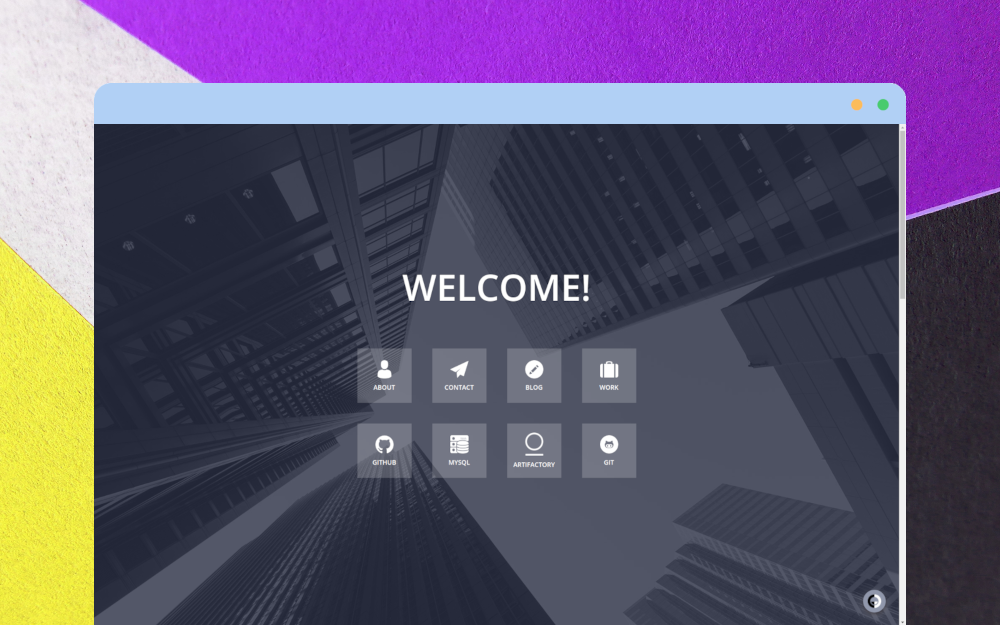

My Personal Site (old)
===================

For a long time I used Yii for myself and at work, I started with version 1.
But the speed of development of Yii leaves much to be desired.
New approaches to development have emerged and it’s time to try them out.
I will save this site as a keepsake.

**Used:** [Yii2](https://www.yiiframework.com/) :broken_heart:

### Preview


# License

```
Copyright 2024 Vitaliy Zarubin

Licensed under the Apache License, Version 2.0 (the "License");
you may not use this file except in compliance with the License.
You may obtain a copy of the License at

    http://www.apache.org/licenses/LICENSE-2.0

Unless required by applicable law or agreed to in writing, software
distributed under the License is distributed on an "AS IS" BASIS,
WITHOUT WARRANTIES OR CONDITIONS OF ANY KIND, either express or implied.
See the License for the specific language governing permissions and
limitations under the License.
```
